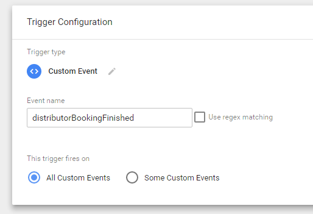
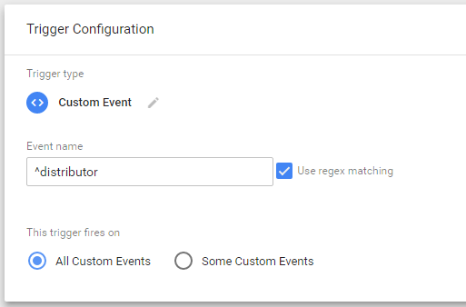
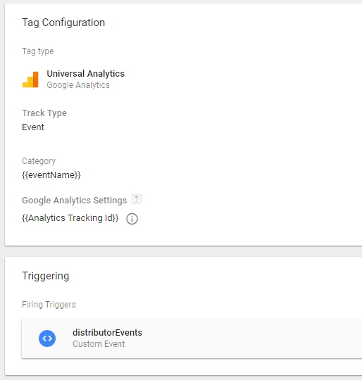
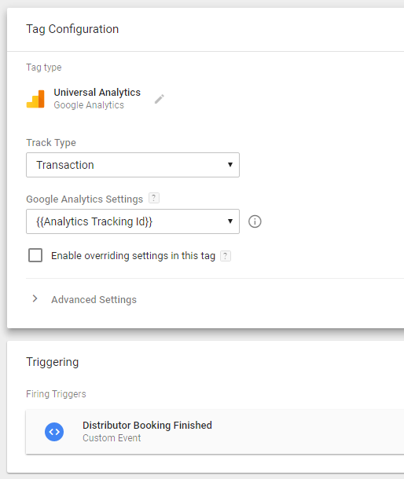
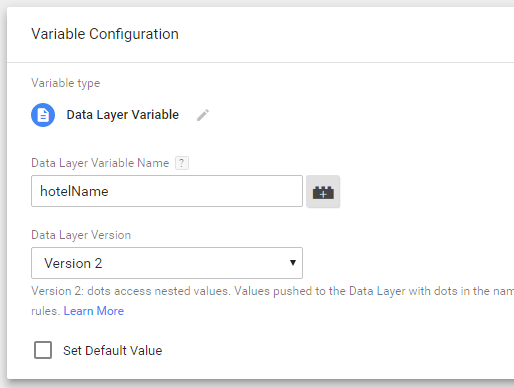

The main and only source of Distributor integrations with 3rd party tags and tracking services is [Google Tag Manager](https://www.google.com/analytics/tag-manager/).

## Google Tag Manager

### Notice of Usage

**Google Tag Manager is a 3rd party service and we provide this integration as is. We export a set of supported events and their data to the container, however, we have no control over what happens with them and how they are used. Below we provide a set of basic setup examples that have been tested and verified to work with Distributor. If you need a more complex setup, it is up to you to configure and test it.**

### Enabling Google Tag Manager in Distributor

You can enable it by passing your container's id in the [`gtmContainerId`](./reference.html#gtmContainerId) option. The id has the `GTM-XXXXXX` format and you can get it in Google Tag Manager.

**Important: It is not enough to just copy and paste the Google Tag Manager container code into a website, you have to use the 'gtmContainerId' option. However, if you use the container on your website, Distributor will connect to it and won't create a new one.**

### Migrating to Google Tag Manager

In previous versions, Distributor supported direct integrations with Google Analytics and Google AdWords. These legacy integrations still remain functional for a backward compatibility, but will be removed completely in the near future. We strongly suggest you migrate them to Google Tag Manager.

**Important: If you enable Google Tag Manager in Distributor, it will take precedence over any legacy integration, and those will not be triggered. It means, that once you enable Google Tag Manager, you will have to migrate all of your integrations to it!**

### Triggers

This is a basic description of how to set up a Distributor event as a Trigger. You can get full reference of all Distributor events [here](#triggers-reference).

For an integration with Google Tag Manager, Distributor provides a set of *Custom Events* that you can set up as *Triggers*. To setup a Trigger for an event, match it with its name:

If you want to track multiple events with one Trigger, you can easily use regex matching on an event name. For example `^distributor` will track every distributor event, which can be useful for setting a Trigger for Universal Analytics:

### Basic setups

#### Universal Analytics

You can track all the events for further statistical computations about behaviour of your customers. Use the Google Universal Analytics tag with `Event` track type. The Trigger should be a regex grouping of all the events you want to track (to track *all* events, you can use `^distributor` regex as described [here](#triggers)).

 

#### Google Ecommerce

You can track transactions with the Google Universal Analytics tag with the `Transaction` track type on the `distributorBookingFinished` event. All the needed data for tracking is set in the Tag Manager's *dataLayer* and will be passed automatically.

##### Tracking with Mews Merchant and source attribution

When you have Mews Merchant set up, a payment by a customer is legally required to happen on our domain. Therefore, all the transactions during a checkout are attributed to Mews domain. This is an unfortunate limitation of the checkout process that we cannot currently overcome.

### Troubleshooting

#### There are no events nor ecommerce transactions tracked after redirect to Mews Merchant page

You have probably included the container into your website, however you haven't set the container id into Distributor. This means that after the redirect, the Distributor will not know anything about your container. You should use [`gtmContainerId`](#gtmContainerId).

#### I've set up the container correctly but there are still no events tracked

If you've everything set up correctly and you still can't see events tracked, please ensure that you're not using any ads blocking or similar software in your browser. These tend to block out not only ads, but also tracking software like Google Tag Manager. Disabling the software for testing or adding your website to exceptions should solve the issue.

**Important:** If you're using Mews Merchant, you need to disable the software for mews.li domain too.

#### The Tag Assistant Chrome extension shows me a warning about multiple installations, but I use only one

Distributor includes our Mews Google Tag Manager container (id `GTM-M7JV35D`) to keep statistics in our own Google Analytics. We use those data for global Distributor performance measuring, to have an idea about performance in hotels that don't use Analytics and for ability to build our own statistics on top of the Analytics Api in Commander.

Having multiple installations is perfectly fine, if you keep common data layer name for all of them, which we do. See the official documentation for yourself: https://developers.google.com/tag-manager/devguide#multiple-containers

### Triggers Reference

All events data are passed to Tag Manager through *dataLayer*. To use it in your tags, set up *Variable* with proper name as variable of the data layer like this:

Each event is fired with standard set of data:

| Data Layer Variable Name | Description
| --- | --- |
| eventName | Data Layer Variable Name of the event in readable form without prefix, i.e. `Step Dates`. |

If a hotel is selected, information about it is also added to the event. (Note: The hotel is always selected in *Singlehotel* mode)

| Data Layer Variable Name | Description
| --- | --- |
| hotelName | Data Layer Variable Name of the hotel |
| hoteId | unique identifier of the hotel |

Some events exposes additional data layer variables. These are described for each event separately.

#### distributorLoaded
The Distributor application was initialized (triggers once per session even with Merchant redirect).

#### distributorOpened
The Distributor was opened.

#### distributorClosed
The Distributor was closed.

#### distributorStepDates
A dates step was displayed.

#### distributorStepHotels
A hotels step was displayed.

#### distributorStepRooms
A rooms step was displayed.

#### distributorStepRates
A rates step was displayed.

#### distributorStepSummary
A summary step was displayed.

#### distributorStepCheckout
A checkout step was displayed.

#### distributorStepConfirmation
A confirmation page was displayed.

#### distributorLanguageCodeChanged
A language code was changed.

| Data Layer Variable Name | Description
| --- | --- |
| languageCode | Language code of selected language, i.e. `en-US`. |

#### distributorStartDateSelected
A start date of reservation was selected.

| Data Layer Variable Name | Description
| --- | --- |
| startDate | Selected start date in ISO 8601 format YYYY-MM-DD, i.e. `2017-01-20`. |

#### distributorEndDateSelected
An end date of reservation was selected.

| Data Layer Variable Name | Description
| --- | --- |
| endDate | Selected end date in ISO 8601 format YYYY-MM-DD, i.e. `2017-01-22`. |

#### distributorPromoCodeSelected
A promo code was set.

| Data Layer Variable Name | Description
| --- | --- |
| promoCode | Value of inserted promo code as string, i.e. `promo`. It is not validated. |

#### distributorOfferedDatesSelected
Alternative dates when there is no availability selected.

#### distributorRoomSelected
A room (or other space type) was selected.

| Data Layer Variable Name | Description
| --- | --- |
| roomId | Guid of selected room. |
| roomName | Data Layer Variable Name of selected room in hotel's default language. |
| spaceType | Data Layer Variable Name of selected room's space type, one of `Room`, `Bed` or `Dorm`.  |

#### distributorSpaceTypeCountChanged
A number of selected "rooms" in order was changed.

| Data Layer Variable Name | Description
| --- | --- |
| count | Number of selected space types. |

#### distributorRoomOccupancyChanged
An occupation (adults and children counts) was changed for one room (or similar) space type.

| Data Layer Variable Name | Description
| --- | --- |
| roomIndex | Index of changed room. |
| adultCount | Number of selected adults. |
| childCount | Number of selected children. |

#### distributorBedOccupancyChanged
An occupation (adults and children counts) was changed for bed space type.

| Data Layer Variable Name | Description
| --- | --- |
| adultCount | Number of selected adults. |
| childCount | Number of selected children. |

#### distributorProductAdded
A product was added to an order.

| Data Layer Variable Name | Description
| --- | --- |
| productId | Guid of added product. |
| productName | Data Layer Variable Name of product in hotel's default language. |

#### distributorProductRemoved
A product was removed from an order.

| Data Layer Variable Name | Description
| --- | --- |
| productId | Guid of removed product. |
| productName | Data Layer Variable Name of product in hotel's default language. |

#### distributorBookingFinished
A booking was made. This event triggers once per reservation group made.

| Data Layer Variable Name | Description
| --- | --- |
| reservationGroupId | id of the reservation group |
| totalCost | total cost of the reservation group, in hotel's default currency |
| currencyCode | hotel's default currency code in ISO format |

#### distributorReservationCreated
A reservation was created. This event triggers for each reservation made in the reservation group.

| Data Layer Variable Name | Description
| --- | --- |
| customerEmail | the customer's email |
| customerName | the customer's name |
| currencyCode | hotel's default currency code in ISO format |
| reservationGroupId | id of the reservation group |
| reservation.id | id of the reservation |
| reservation.rateId | if of the rate of the reservation |
| reservation.number | confirmation number of the reservation |
| reservation.roomName | Data Layer Variable Name of the room|
| reservation.startDate | start date of the reservation |
| reservation.endDate | end date of the reservation |
| reservation.nights | total nights spent |
| reservation.cost | cost of the reservation in hotel's default currency |

